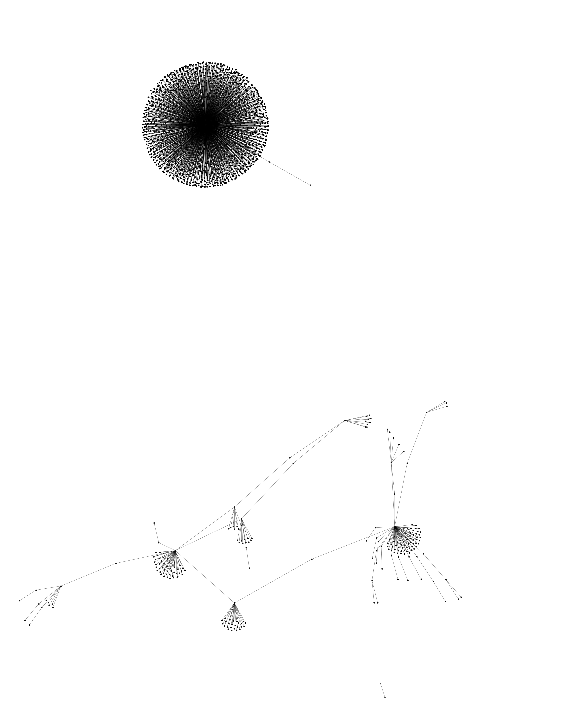
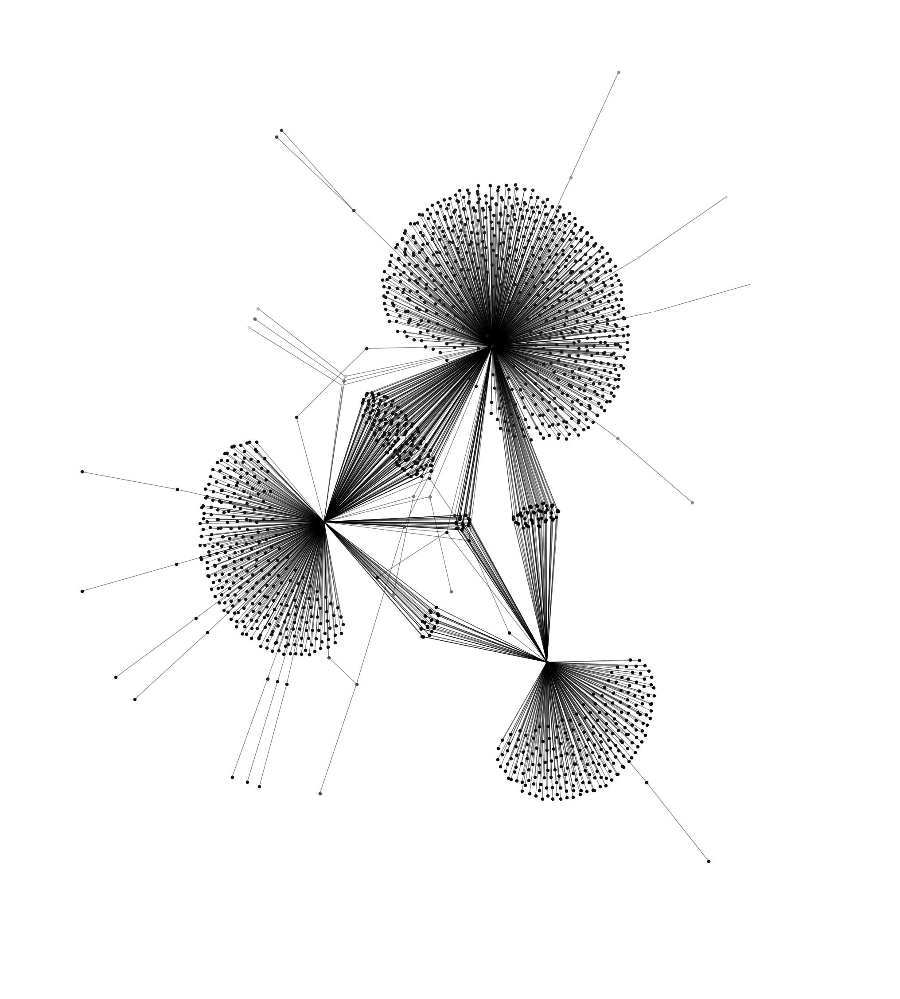
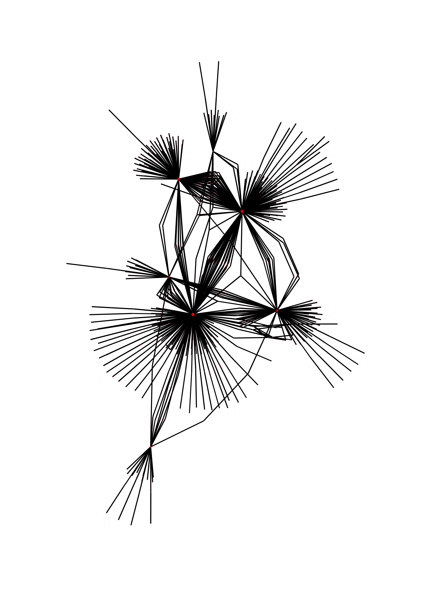

# RI5C: Smart Contract Analysis Tool
## Python3 - NetworkX – BigQuery - SigmaJS implementation of an easy to use, simple framework to navigate smart contracts in Ethereum using network analysis, a network based blockchain navigator.

This implementation uses NetworkX: https://github.com/networkx/networkx, Pandas, Maplotlib, SigmaJS and Python-Louvain for simple community arranging. **Some work is missing, but this can already produce interesting network analyses** 

Please donate some BTC to support the project: **1DbTky3KKfY5aShvHy4mrsSzHQZhsPr3zK**


## Motivation
Due to the public nature of transaction data on blockchain based financial systems, it is possible to model these systems as a network and analyze its structure to provide and define whether the different variables that emerge in the transaction history of ERC20 tokens can be used to correlate the health of the system and therefore propose a risk coefficient that quantifies how active the token is, how distributed it is and infer how likely it is to respond to contagion and how stable the price is.

## Quick start
As is standard everything you need is in ```requirements.txt```. 

If it's your first time using vagrant, check out how to use it [here](https://www.vagrantup.com/docs/installation/).
```
vagrant up
get server running and start creating stuff
vagrant ssh

$ cd /vagrant/
$ python3.6 # To run a console
```

Instantiate SQL tables

```
from schema.DBManager import DBManager
db = DBManager()
db.create_searches_table()
```

### SQL Search Persistence

Searches are persisted by default in "searches" table that you instantiated. You can do other things if you need to, the db is called "mydb", to load psql console type:

```
psql -d mydb
```

Use of this database is optional and might not be used, however it might be practical to save large amounts of data and perform local queries to save costs on BigQuery.

### Configuring BigQuery
Note that this software uses Google's BigQuery Ethereum dataset, based on the fantastic work found of Evgeny Medvedev: https://github.com/blockchain-etl/ethereum-etl.

You should activate a BigQuery account following these instructions: https://cloud.google.com/blog/products/data-analytics/ethereum-bigquery-public-dataset-smart-contract-analytics

and you should have your access info in ```ri5c/config/big_query_cred.json```

PS: the location of that file is specified in an environment variable called ```GOOGLE_APPLICATION_CREDENTIALS```


## Load data and Evaluate
Find an interesting contract: ([OmiseGo](https://omisego.network)) ```omisego = "0xd26114cd6ee289accf82350c8d8487fedb8a0c07"```

And now, from Python console run:

### Tornado server that will draw your contract of choice using SigmaJS

Use bundled minified SigmaJS data or go to [their repo](https://github.com/jacomyal/sigma.js) for an updated version, *then run a simple Python server* on your root folder:

```python3.6 main.py```

And go to 127.0.0.1:8000 to view the results

Choose a contract and type it into the "Get Contract" box.

### For a PNG network drawn with Maplotlib and NetworkX

```from ri5c.get_contract import network_this```

```network_this(omisego, limit=3000)```

Where *limit* is the transaction limit.

This will save the prepared data as *network.png* on your source folder

## Maplotlib Examples: ie: interesting contracts

Note: These are examples graphed with Maplotlib, current iteration graphs using SigmaJS

### OmiseGo

```omisego = "0xd26114cd6ee289accf82350c8d8487fedb8a0c07"```

Data retrieved on March 2019:
- Transaction limite: 2,500
- Nodes: 2544
- Edges: 2489
- Average degree: 1.9568



### CryptoKitties

```cryptokitties = "0x06012c8cf97bead5deae237070f9587f8e7a266d"```

Data retrieved on March 2019:
- Transaction limit:  3,000
- Nodes:  1625
- Edges:  1936
- Average degree:  2.3828



### Tatatu

This is an experiment with weighted graph.
```tatatu = 0x9cda8a60dd5afa156c95bd974428d91a0812e054```

Data retrieved on March 2019:
- Transaction limit: 2,500
- Nodes: 1776
- Edges: 1812
- Average degree: 2.0405



## Room to grow
Feel free to collaborate, there are some issues and a project board. Please fork and grow. This code is open source, check [the license](/LICENSE)

